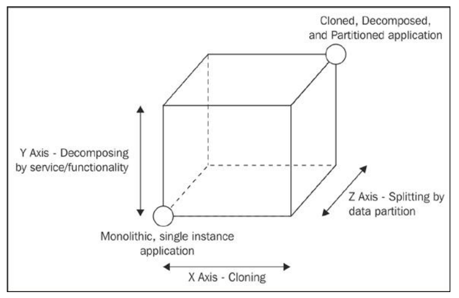
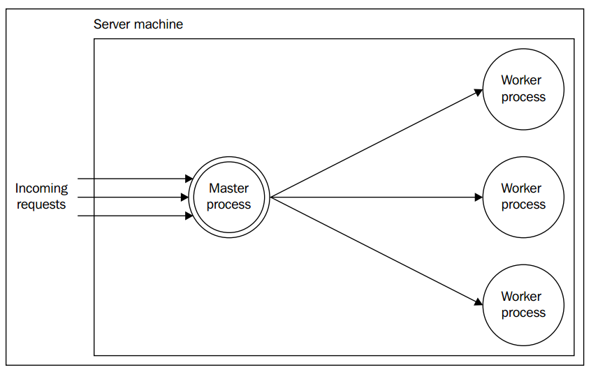
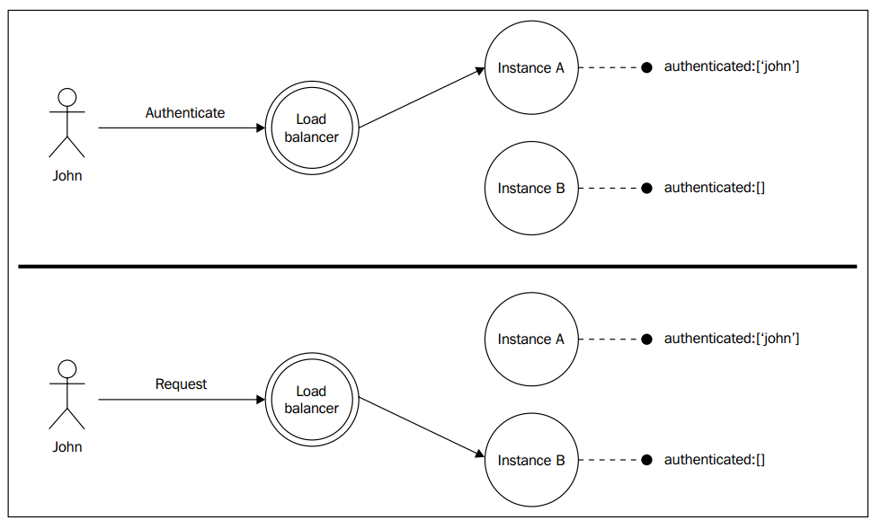
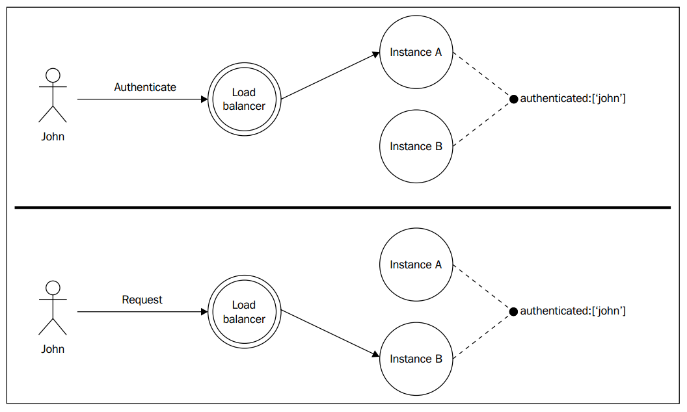
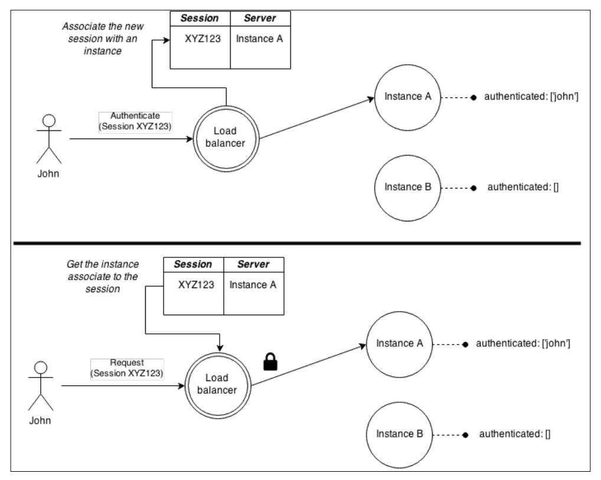
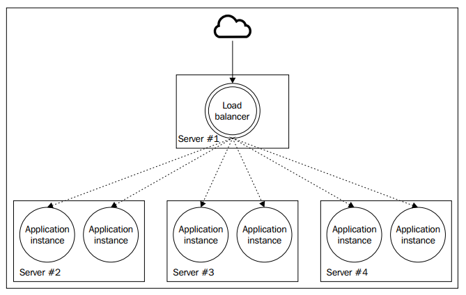
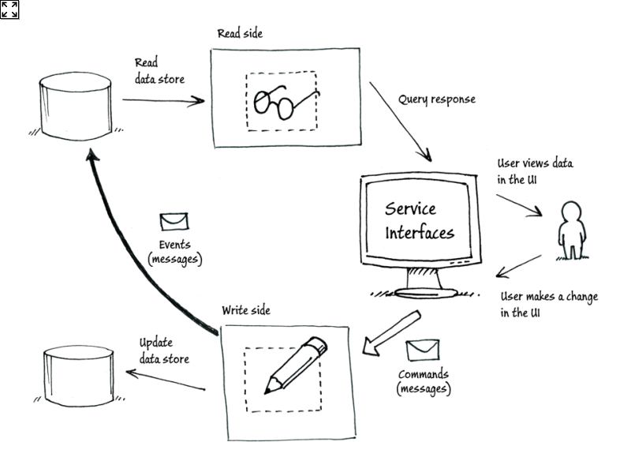

# 从 Node.js 看看服务端框架的一些感想

> 为什么写这篇文章？因为早上在思考一个问题「想获取一家公司的数据（内容型公司），反爬措施做的比较好（VIP会员制度，访问次数太多会锁掉账号）。有几个方向想去尝试：1.App 逆向破解看看网络请求部分的参数是如何生成的；2.Charles 抓包破解参数部分看看能否模拟；3.查看小程序是否有漏洞。最后想来想去还是算了，因为反爬虫措施即使破解了，但是当请求的次数较多的时候还是会封锁 VIP 账号。最后想的是找出封锁账号的请求次数的临界值，然后用爬虫手段去获取数据，但是不能超过临界值就可以。因为 VIP 账号价格实在太高就放弃了。过了几天我想到了用浏览器插件的方式去做这个事情。也就是在对方的网站里面注入我们的 JS 脚本，脚本会在网站上面添加一个按钮，点击按钮就可以将数据同步到我们自己的数据中心。废话说了一大堆，因为 JS 在浏览器环境里面不具备服务端的能力所以想到的是通过接口将数据让一个 Node.js 的服务去处理，将数据入库等操作。问题正式进入主题，要开发微服务的过程中选择用 Node 的 express 还是 Koa 还是 eggjs 等问题困扰了我一会儿。这篇文章不针对这些具体的库进行讨论，而是对于服务端的一些思考」

## 优秀的后端框架？

一个什么样的框架算得上是优秀或者合格？有个需求让你写一个 HTTP 服务，借助于 express 你可能初始化项目、安装依赖、写完代码都用不了6分钟？觉得似乎很简单，哥们儿你想想这是一个服务，而不是说让你能跑就行了。计算机学生的平时作业差不多满足了。但是你说你这个东西能打吗？可以说“战五渣”。一旦部署到线上环境，可能瞬间就被大量涌入的请求击垮，更何况有些人要攻击你。换个角度思考问题。加入你的线上程序需要升级，你该怎么办？停止当前的服务让用户等待一段时间吗？

所以一个后端服务必须满足2个特性：

- 容错性强（Fault tolerate）
- 可拓展性高（Scalability）

其他的特性也很重要，比如程序的健壮性、接口设计友好、代码修改起来灵活等等特性。但是容错性、可拓展性是服务正常运行的基本保障。至少得向用户保证服务是可用的。无论代码写的多优雅它都是为业务所服务的。

## 拓展性（Scalability）

- X轴：纯粹对服务的实例进行拓展。为了响应更多的请求
- Y轴：未服务添加新的给你。功能性拓展
- Z轴：按照业务数据对服务进行拓展

## 实例拓展


增加服务实例包括两类：横向拓展、纵向拓展。横向拓展表示利用更多的及其。纵向拓展表示在一台及其上挖掘它的潜力。

NodeJS 程序是单进程运行的。32位机器上最多只有 1GB 内存的实用权限（在 64GB 机器上的最大内存权限扩大到 1.7GB）。目前绝大部分线上服务器 CPU 都是多核并且至少 16GB。如此 Node 便无法发挥机器的最大能力。Node 早就意识到这一点，它允许创建多个子进程运行多个实例。

有一个主进程 master，但是 master 进程并不实际处理业务逻辑，但是除了业务逻辑之外的事情它都负责。它是 manager，负责启动子进程、管理子进程（如果进程挂到了则需要重启）。同时扮演 Router 的角色，也就是对程序的所有访问请求都先到达主进程，主进程分配请求给子进程 worker（子进程负责处理业务逻辑）

这个机制下有两条细节需要处理。
1. 如何把外界的任务平均分配给不同的 worker 处理？这里的平均并不是指数量上的平均（因为每个请求的工作量可能不同）。不能让某个子进程太闲，也不能让某个子进程太忙，而是始终处于工作的状态。也就是「负载均衡（load-balancing）」。默认情况下 Clust 模块采用的是 **round robin** 负载均衡算法，说白了就是依次按照顺序把请求指派给列表上的子进程，到结尾之后重头开始。

这个算法只能保证每个子进程收到的请求个数是是平均的。但如果某个进程本来的任务很复杂，后来又由于不断的收到被平均指配的任务，那么这个子进程的压力就很大了。除此之外我们需要考虑超时、重做机制，所以主进程 master 作为路由时不仅仅需要转发请求，还需要智能的分配请求

另一个问题是状态共享问题，假如某个用户第一次访问该服务时是分配给了线程A上的实例A处理，并且用户在这个实例上进行了登陆，而没有过几秒钟之后当用户第二次访问时分配给了线程B上的实例B处理，如果此时用户在A上的登陆状态没有共享给其他实例的话，那么用户不得不重新登陆一次，这样的用户体验是无法接受的。如下图所示 

解决方案1:将状态共享

解决方案2:新增一个模块专门用于记录用户第一次访问的实例。并在之后当用户访问服务时始终指派访问该实例

主进程-子进程的模式思路不仅可以用于「纵向拓展」，还适用于「横向拓展」。当单台机器已经无法满足你需求的时候，你可以把单实例子进程的概念拓展为单台机器：我们将在多台机器上部署多个进行实例，用户的访问请求也并非直接到达它们，而是先到达前方的代理机器，它也是负责负载均衡的机器，负责将请求转发给部署了应用实例的机器。这样的模式我们也通常称为反向代理模式：

这个模式仍然可以继续改进：动态的启动或者关闭机器上的若干实例用于节省资源、移除负载均衡这一环节用于提高通讯的效率。

对于所有的开发来说，很多道理都是通用的。比如设计模块、解耦思想。上面说的负载均衡、反向代理等等不只是 Java、Node、PHP、.Net 等都存在。所以只要是服务端的概念，Node 里面一样存在。（有的 Node 工程师是从前端开发转过来的，所以在此强调。）虽然 Node.js 较新，但是解决思路或者方案可以借鉴传统的服务端方案。跳出语言的限制去看待问题、解决问题、寻找思路和方案

## 功能拓展

你也许会问新增功能有什么难点？每个程序员的日常就是不断的进行功能迭代。但在这里我们希望解决一个问题，就是既然我们无法保证功能不会出错，那我们有没有办法保证当一个功能出错之后不会影响整个程序的正常运行？这也是我们所说的容错性。

道理都懂，我们都明白程序需要容错，所以try/catch是从编码上解决这个问题。但问题是try/catch不是万能的，万无一失的程序也是不存在的，所以我们要换个思路解决这个问题，我们允许程序出错，但是要及时把错误隔离，并且不再影响程序的运行。这个就要从架构上解决这个问题。例如使用微服务（Microservices）架构。

在介绍微服务架构之前，我们要了解其它架构为什么没法满足我们的要求。例如我们常用的单体（monolithic）架构。单体架构这个词你可能不熟悉，但几乎我们每天都在和它打交道，大部分的后端服务都归属于单体架构，对它的解释我翻译Martin Fowler的描述：

企业级应用通常分为三个部分：用户界面（包含运行在用户浏览器上的html页面和javascript脚本），数据库（通常是包含许多表的关系数据库），和服务端应用。服务端应用将会处理http请求，执行业务逻辑，从数据库中取得数据，生成html视图返回给浏览器。这样的服务端应用就被称为单体（monolith）——单个具有逻辑性的执行过程。任何针对系统的修改都会导致重新构建和部署一个新版本的服务端应用。

（注：以上这段描述摘自Martin Fowler的文章Microservices，我认为这是对微架构描述最全面的文章，如果想对这一小节做更深入的了解可以把这篇文章细读。 这也是我读到的Martin Fowler所写的文章中最通俗的文章。个人认为Martin Fowler的文章读起来比较晦涩，John Resig紧随其后）

单体架构是一种很自然的搭建应用的方式，它符合我们对业务处理流程的认知。但单体应用也存在问题：任何一处，无论大小的修改都会导致整个应用被重新构建和重新部署。随着应用规模和复杂性的不断增大，参与维护的人数增多，每一轮迭代修改的模块增多，对上线来说是极大的考验，对于内部单个模块的拓展也是极为不利的。例如当图片压缩请求剧增时，需要新增图片压缩模块的实例，但实际上不得不扩展整个单体应用的实例。

微服务架构解决的就是这一系列问题。顾名思义，微服务架构下软件是由多个独立的服务组成。这些服务相互独立互不干预。以拆分上面所说的单体应用为例，我们可以把处理HTTP请求的模块和负责数据库读写的模块分离出来成为独立的服务，这两个模块从功能上看是没有任何交集。这样的好处就是，我们可以独立的部署，拓展，修改这些服务。例如应用需要添加新的接口时，我们只需要修改处理HTTP请求的服务，只公开这部分代码给修改者，只上线这部分服务，拓展时也只需要新添这部分服务的实例。

微服务和我们通常编写的模块（以文件为单位，以命名空间为单位）相比更加独立，更像是一个五脏俱全的“小应用”，如果你读完了我之前推荐的Martin Fowler关于微服务的文章的话，你会对这点更深有感触：微服务除了在运维上独立以外，它还可以拥有独立的数据库，还应该配备独立的团队维护。它甚至可以允许使用其他的语言进行开发，只要对外接口正常即可。

当然微服务也存在不足，例如如何将诸多的微服务在大型架构中组织起来，如何提高不同服务之间的通信效率都是需要在实际工作中解决的问题。

微服务说到底还是解耦思想的实践。从这个意义上来说，React下的Flux架构某种意义上也属于微服务。如果你了解Flux的起源的话，Flux架构其实来源于后端的CQRS，即Command Query Responsibility Segregation，命令与查询职责分离，也就是将数据的读操作和写操作分离开。这么设计的理由有很多，举例说一点：在许多业务场景中，数据的读和写的次数是不平衡，可能上千次的读操作才对应一次写操作，比如机票余票信息的查询和更新。所以把读和写操作分开能够有针对性的分别优化它们。例如提高程序的scalability，scalability意味着我们能够在部署程序时，给读操作和写操作部署不同数量的线上实例来满足实际的需求。

如果你也有Unity编程经验的话会对解耦更有感触，在Unity中我们已经不能称之为解耦，而是自治，这是Unity的设计模式。举个例子，屏幕上少则可能有十几个游戏元素，例如玩家、敌人还有子弹。你必须为它们编写“死亡”的规则，“诞生”的规则，交互的规则。因为你根本无法预料玩家在何时何种位置发射出子弹，也无法预料子弹何时在什么位置碰撞上什么状态敌人。所以你只能让它们在规则下自由发挥。这和微服务有异曲同工之妙：独立，隔离，自治。

## 总结

Node 作为服务端的新人，应该学习前辈的经验。借用奔驰广告的一句话：经典是对经典的继承、经典是对经典的背叛。只有站在前人的肩膀上，我们才有可能创新，看的更远

（以上文章部分参考自网络，因为本人看到后相见恨晚，和我思想观念一致，所以搬运总结于此，望共勉）