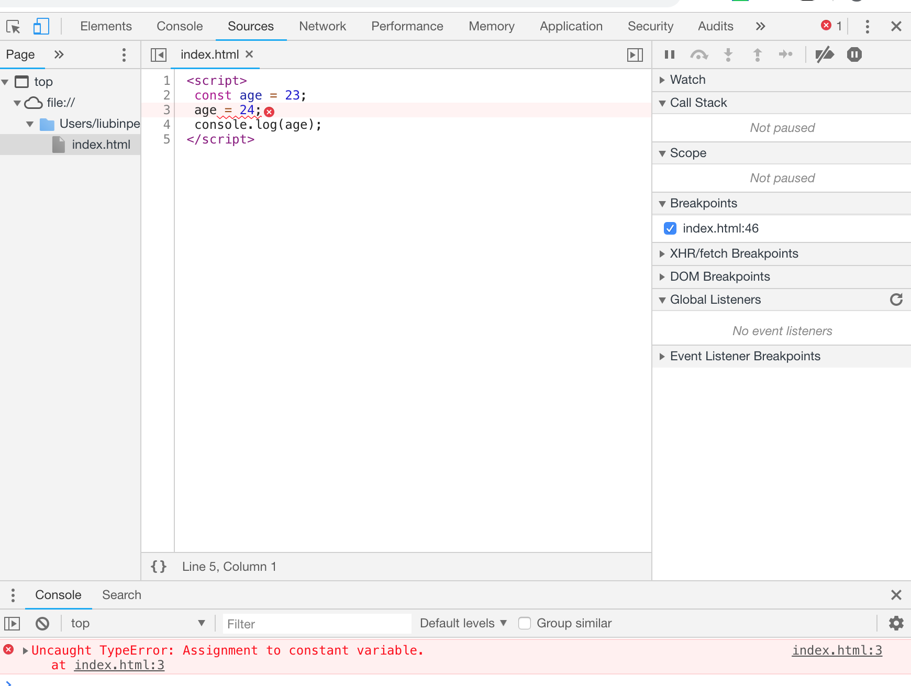
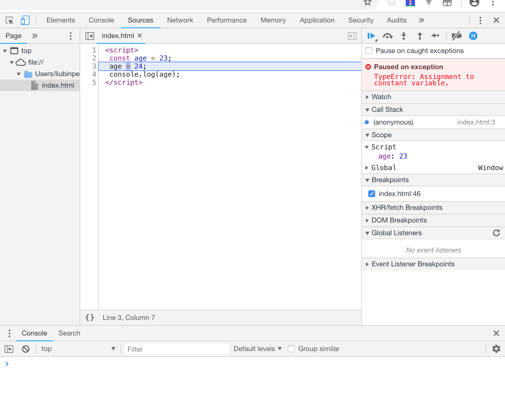
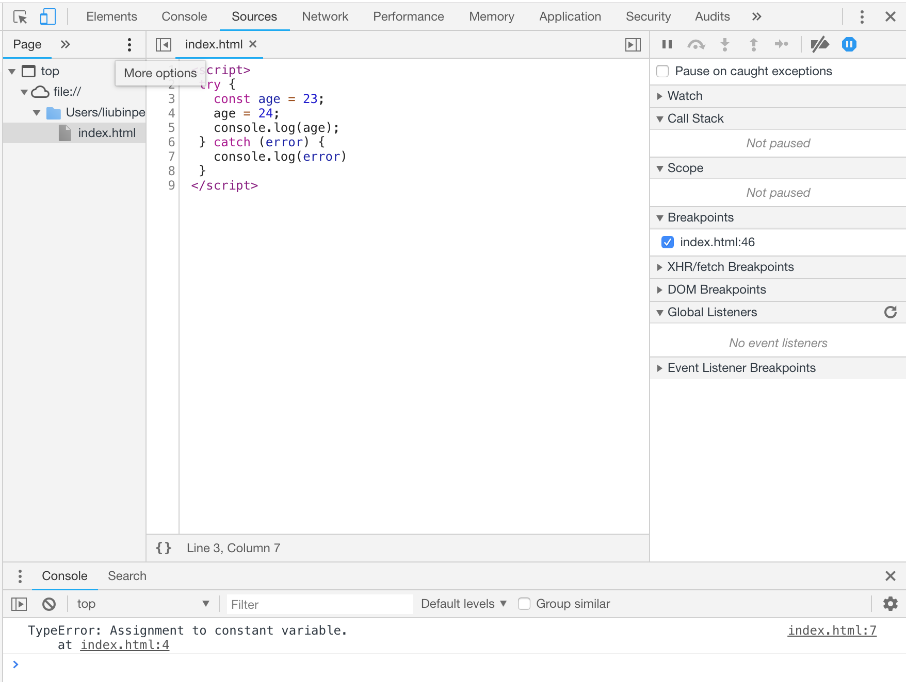
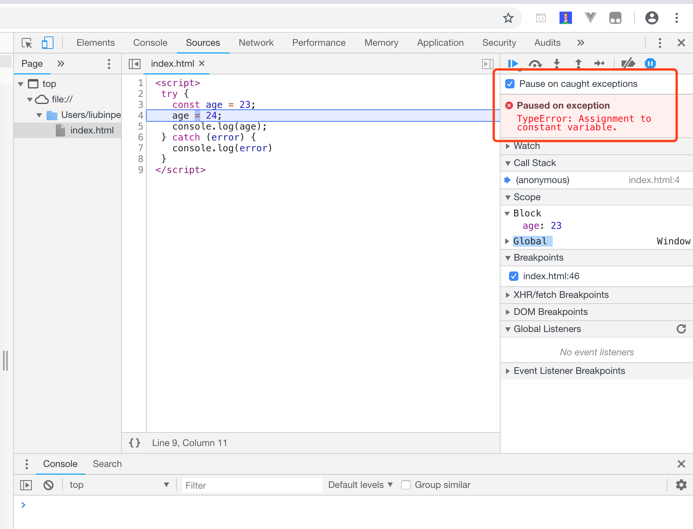

# Chrome 调试技巧

> Chrome 有非常多强大且实用的调试技巧。这里介绍总结下

## 异常调试

```
<script>
const age = 23;
age = 24;
console.log(age);
</script>
```

代码会报错。为了诸多原因，我们希望提前解决，所以我们希望准确知道代码在哪里有问题。也就是需要调试，希望 JS 像其他编程语言一样可以调试。

默认情况下会在 console 里面报错。如下图


为了准确定位，我们可以在调试模式的右侧开启 “Pause on exception”按钮


如果我们的代码加了 try.catch.，那么之前的设置是不能定位到异常的位置。

```
 <script>
  try {
    const age = 23;
    age = 24;
    console.log(age);
  } catch (error) {
    console.log(error)
  }
 </script>
 ```
 

 如果想捕获try.catch里面的异常，则可以在调试面板的右侧勾选“Pause on caught exceptions”，设置完即使是 try.catch 里面的异常也可以定位到具体位置
 )